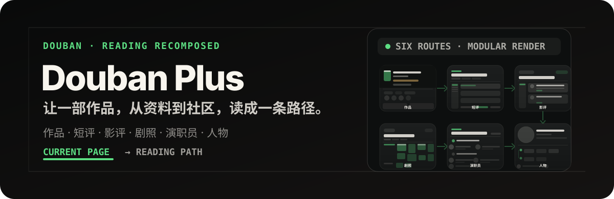
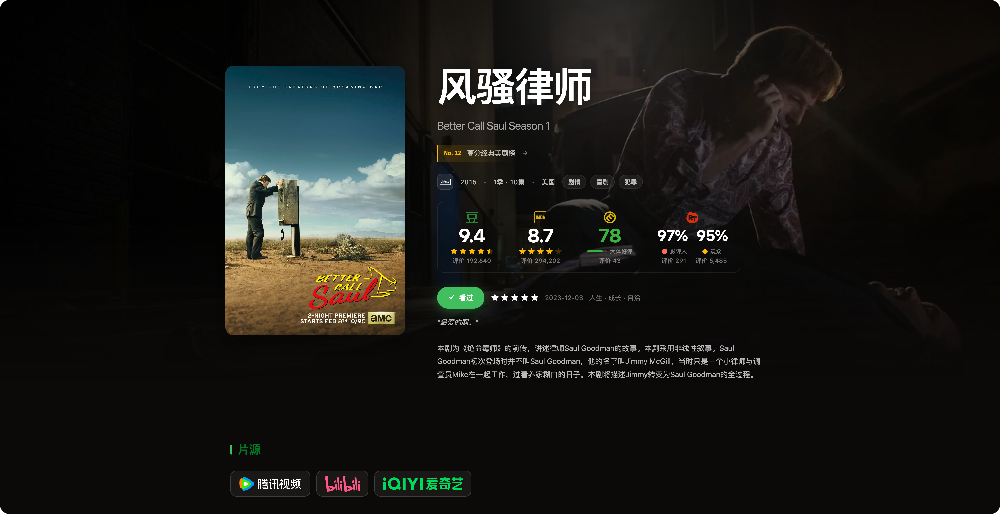
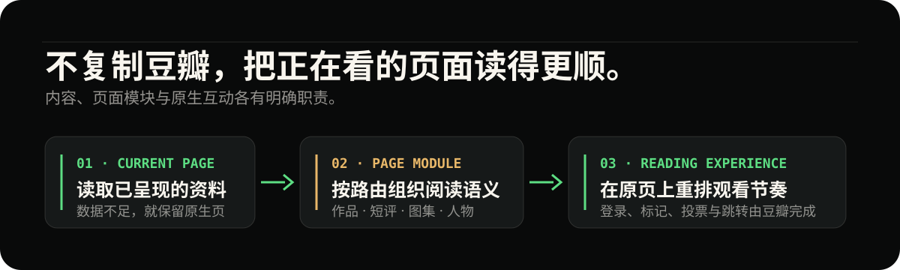

# Douban Plus

<p align="center">
  
</p>

<p align="center">
  <a href="https://greasyfork.org/zh-CN/scripts/585771-douban-plus"></a>
  <a href="https://scriptcat.org/zh-CN/script-show-page/6712"></a>
  
</p>

Douban Plus 是面向 ScriptCat、Tampermonkey、Violentmonkey 与 Greasemonkey 的豆瓣电影增强脚本。它不另建一套内容站：从你正在看的豆瓣页面读取可见资料，重新组织为适合连续浏览的暗色阅读界面；登录、标记、投票、上传与跳转仍由豆瓣原生流程完成。

## 先看结果

两张真实页面截图：一张作品页，一张人物页。它们不是概念稿，也不是独立站的界面。

<p align="center">
  
  
</p>

## 它重编排什么

Douban Plus 以页面为单位工作。每条路由都有自己的提取、领域数据、呈现与运行时，而不是用一张通用模板覆盖豆瓣。

| 页面 | 观看方式 |
| --- | --- |
| `movie.douban.com/subject/<id>/` | 作品 Hero、外部评分、影像、演职员、短评、影评、讨论、推荐与详细资料按阅读节奏排布。 |
| `movie.douban.com/subject/<id>/comments` | 短评总览保留看过 / 在看 / 想看、排序、评分与分页；切换结果在当前页无刷新更新。 |
| `movie.douban.com/subject/<id>/all_photos` | 已加载的剧照、海报与壁纸被重排成比例稳定的瀑布流，不枚举未打开的分类页。 |
| `movie.douban.com/subject/<id>/reviews` | 影评总览按阅读节奏排布，保留排序与评分筛选，切换结果无刷新。 |
| `movie.douban.com/subject/<id>/celebrities` | 当前作品的演职员资料按页面语义重组，并保留原生出口。 |
| `www.douban.com/personage/<id>/` | 人物身份、常合作的人、图片、近期与代表作品、获奖记录形成一条人物阅读路径。 |

## 为什么仍然是豆瓣

<p align="center">
  
</p>

- **只从当前页面起步**：数据不足时不强行渲染半成品，保留原生页面。
- **增强与账户权限分离**：脚本负责呈现与局部状态；账号相关写入始终走豆瓣的登录、标记、投票或上传入口。
- **认证后同步同一份页面快照**：登录后，增强界面和仍需原生承接的互动出口会一起更新，不要求整页刷新。
- **为阅读而不是炫技而动**：支持桌面与移动端，并尊重 `prefers-reduced-motion`。

## 安装并开始使用

1. 安装任一脚本管理器：Tampermonkey、Violentmonkey、Greasemonkey 或 ScriptCat。
2. 从 [Greasy Fork](https://greasyfork.org/zh-CN/scripts/585771-douban-plus) 或 [ScriptCat](https://scriptcat.org/zh-CN/script-show-page/6712) 安装脚本。
3. 打开一部电影、剧集、图集、演职员或人物主页；匹配的页面会自动增强。

也可以从源码构建：

```bash
pnpm install
pnpm build
```

随后把 [`dist/douban-plus.user.js`](./dist/douban-plus.user.js) 的完整内容安装到你的脚本管理器。

## 开发

```bash
git clone https://github.com/ZlatanCN/douban-plus.git
cd douban-plus
pnpm install
pnpm dev
```

| 命令             | 用途                                         |
| ---------------- | -------------------------------------------- |
| `pnpm dev`       | 启动 Vite 开发服务器与 userscript 开发注入。 |
| `pnpm run fix`   | 格式化与修复源码样式。                       |
| `pnpm typecheck` | 检查源码和测试的 TypeScript 类型。           |
| `pnpm test`      | 运行 Vitest 单元与集成测试。                 |
| `pnpm build`     | 生成 `dist/douban-plus.user.js`。            |
| `pnpm test:e2e`  | 在真实豆瓣页面执行 Playwright QA。           |

开发注入由 `vite-plugin-monkey` 提供。若豆瓣页面 CSP 阻止本地开发注入，需要在本地浏览器环境中处理该限制。

## 项目结构

```text
src/
  main.ts                    # 根据 URL 选择页面模块
  modules/
    subject/                 # 作品详情页
    subject-comments/        # 作品短评总览页
    subject-reviews/         # 作品影评总览页
    subject-all-photos/      # 作品图集总览页
    subject-celebrities/     # 演职员页
    personage/               # 人物页
  domains/
    review-reader/           # 跨页面的影评阅读领域模块
  shared/                    # 无页面语义的组件、hooks、运行时与工具
  styles.css                 # 唯一样式清单
```

## 开源协议

[MIT](./LICENSE)
